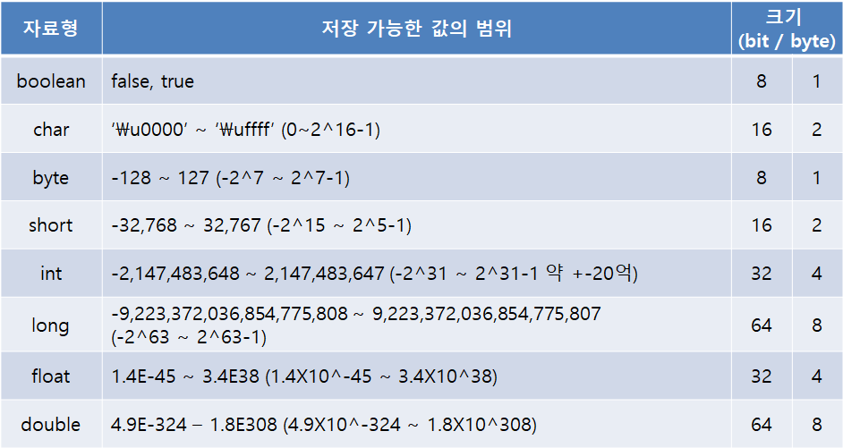

# 변수

# 변수(variable)

정의: 단 하나의 값을 저장할 수 있는 메모리 공간


# 변수의 명명 규칙 4가지

1. 대소문자가 구문되며 길이에 제한이 없다.
2. 예약어를 사용해서는 안된다.
3. 숫자로 시작해서는 안된다.
4. 특수문자는 '_'와 '$'만을 허용한다.


# 기본형과 참조형

**기본형(primitive type):** 논리형(boolean), 문자형(char), 정수형(byte, short, int, long), 실수형(float, double)

**참조형(reference type):** 객체의 주소를 저장한다. 8개의 기본형을 제외한 나머지 타입. 클래스를 작성한다는 것은 새로운 참조형을 추가하는 셈이다.


기본형(primitive type)

boolean을 제외한 나머지 기본형들은 서로 연산과 변환이 가능하다.



기본형의 크기와 범위


# 상수

상수를 선언할 때는 자료형 앞에 final 붙이면 됨.

상수의 이름은 모두 대문자로 하는 것이 암묵적인 관례이며, 여러 단어로 이루어져있는 경우 '_'로 구분


# 리터럴(literal)

프로그래밍에서 상수를 '값을 한 번 저장하면 변경할 수 없는 저장공간'으로 정의하였기에 이와 구분하기 위해 원래 의미의 상수를 다른 이름으로 불러야만 했다. 그렇게 사용되는 것이 리터럴(literal)이다.

 

# 타입의 불일치

리터럴의 타입은 저자될 변수의 타입과 일치하는 것이 보통이지만, **타입이 달라도 저장범위가 넓은 타입에 좁은 타입의 값을 저장하는 것은 허용**된다.

```jsx
int i = 'A';
long l = 123;
double d = 3.14f;
```