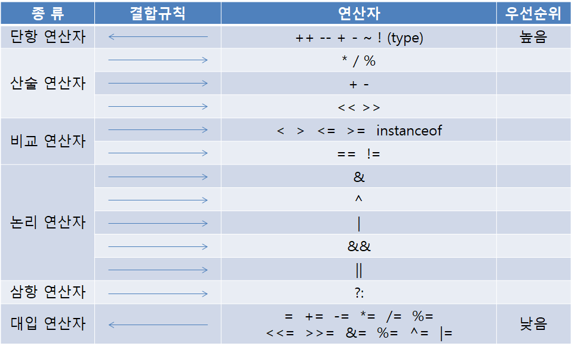

# 연산자(Operator)

# 연산자와 피연산자

**연산자(operator)** 연산을 수행하는 기호(+,-,*,/ 등)

**피연산자(operand)** 연산자의 작업 대상(변수, 상수, 리터럴, 수식)




## 단항 연산자

### 산술변환

연산 수행 직전에 발생하는 **자동 형변환**

이항 연산자는 두 피연산자의 타입이 일치해야 연산이 가능하므로, 피연산자의 타입이 서로 다르다면 연산 전에 형변환 현산자로 타입을 일치시켜야한다.

```java
float result = f + (float)i;  // 형변환으로 두 피연산자의 타입을 일치
```

대부분의 경우, 두 피연산자의 타입 중에서 더 큰 타입으로 일치시킨다. 그작은 타입으로 형변환하면 원래의 값이 손실될 가능성이 있기 때문이다.

```java
float result = f + i; //큰 타입으로 형변환시, 형변환연산자 생략가능
```

피연산자 타입의 일치를 위해 자동 형변환되는 것을 '산술 변환' 또는 '일반 산술 변환'이라 하며, 이 연산은 단항 연산에서도 일어난다.

**규칙 1**. 두 피연산자의 타입을 같게 일치시킨다.(보다 큰 타입으로 일치)

```java
long + int  → long + long → long
float + int → float + float -> float
double + float → double + double -> double
```

**규칙 2**. 피연산자의 타입이 int보다 작은 타입이면 int로 변환된다.

```java
byte + short -> int + int -> int
char + short -> int + int -> int
```

> 모든 연산에서 '산술 변환'이 일어나지만, 쉬프트 연산자(<<, >>), 증감 연산자(++, --)는 예외이다.


# 단항연산자

### 증감연산자

전휘영(prefix)

++a, --a

후위형(postfix)

a++, a--

### 부호 연산자 + -

```java
int i;
i = -10;
i = +i;  //출력: 10
i = -i;  //출력: -10
```


# 산술 연산자

## 사칙 연산자 + - * /