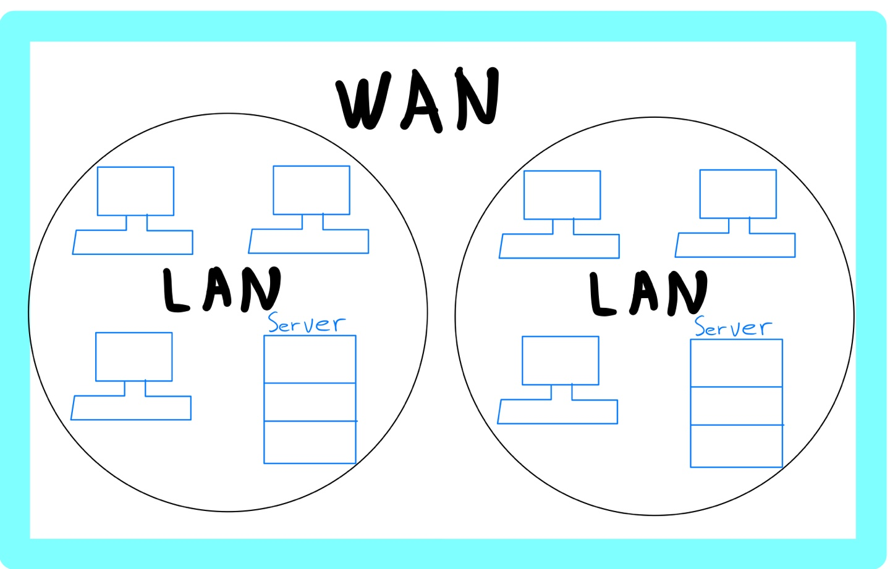

# 1장 - 네트워크 첫걸음

네트워크의 구조 [https://brunch.co.kr/@erid3232/9](https://brunch.co.kr/@erid3232/9)

# 네트워크의 구조

## 컴퓨터 네트워크란?

네트워크는 Net + Work의 합성어로, 일반적으로 기기 뿐 아니라 사람 등 모든 객체의 상호작용을 의미한다. 그 중에서 컴퓨터공학에서 말하는 네트워크는 통신 기술을 이용하여 두 대 이상의 컴퓨터 간의 네트워크를 연결한 것을 의미한다. 

[https://img1.daumcdn.net/thumb/R1280x0.fpng/?fname=http://t1.daumcdn.net/brunch/service/user/7zsI/image/guBnVCYsiQWOoU7_eQVb7ytj1FI.png](https://img1.daumcdn.net/thumb/R1280x0.fpng/?fname=http://t1.daumcdn.net/brunch/service/user/7zsI/image/guBnVCYsiQWOoU7_eQVb7ytj1FI.png)

[그림 1-1] 컴퓨터 네트워크 이미지

앞으로는 이 컴퓨터 네트워크를 네트워크라고 부르겠다.

네트워크는 컴퓨터간에 데이터 전송, 웹 사이트 열람, 메일 송,수신 등과 같은 일을 할 수 있다.

> 네트워크 용어로는 우리가 잘 알 고 있는 인터넷도 있다. 인터넷은 전 세계의 큰 네트워크부터 작은 네트워크까지를 연결하는 거대한 네트워크를 말한다.

## 패킷이란?

네트워크를 통해 전송되는 데이터의 작은 조각이다. 이 조각을 **블록**이라고 표현하며, 택배라고 생각하면 좋을 듯하다.

네트워크는 기본적으로 데이터를 보낼 때 하나의 데이터를 더 작은 데이터들로 쪼개서 전송한다. 하나의 거대한 데이터를 쪼개서 보내지 않으면 그 데이터가 네트워크 상에서 **대역폭**을 크게 차지하기에 자칫 네트워크의 문제를 야기시킬 수 있다.

고속도로를 생각해보면 대형 트럭 하나가 교통체증을 유발하기도 한다. 이런 맥락으로 대형 트럭에 들어갈 짐들을 대형 트럭이 아닌 소형차에 나눠 담아 발송하는 것이라고 생각하면 좋을 듯하다.

[https://img1.daumcdn.net/thumb/R1280x0.fpng/?fname=http://t1.daumcdn.net/brunch/service/user/7zsI/image/r0gShwG_Pe3yesm_BnbKoWZoP_4.png](https://img1.daumcdn.net/thumb/R1280x0.fpng/?fname=http://t1.daumcdn.net/brunch/service/user/7zsI/image/r0gShwG_Pe3yesm_BnbKoWZoP_4.png)

[그림 1-2] 패킷 개념

각각의 소형차(패킷)에 담긴 데이터들은 목적지에서 원래 데이터로 되돌리는 작업을 한다. 이를 위해 패킷은 전송 시작 전에 순서대로 번호가 부여되며, 목적지에서 번호대로 정렬되어 원래의 데이터로 복구가 가능하다.

패킷을 통해 네트워크 상에서 데이터를 교환하는 방식을 **패킷 교환 방식**이라고 부른다.

---

### 패킷의 구조

[https://img1.daumcdn.net/thumb/R1280x0.fpng/?fname=http://t1.daumcdn.net/brunch/service/user/7zsI/image/WU9qeqeSxO3oKrCDBqQp67i7srA.png](https://img1.daumcdn.net/thumb/R1280x0.fpng/?fname=http://t1.daumcdn.net/brunch/service/user/7zsI/image/WU9qeqeSxO3oKrCDBqQp67i7srA.png)

[그림 1-3] 패킷의 구조

1. IP Version: 사용 중인 IP 버전을 식별하는 데 사용. 버전 4(IPv4) 또는 버전 6(IPv6) 중 하나만 선택 가능

2. TTL(Time to Live): 이 패킷이 네트워크에 남아있을 수 있는 시간. 이 패킷을 처리하는 각 라우터는 이 카운터를 하나 이상 감소시킴.

3. Protocol: IP 패킷의 데이터 부분이 전달되는 전송 계층 프로토콜. TCP 또는 UDP를 의미함.

4. Header Checksum: 검증 계산의 기반이 되는 헤더 체크섬 데이터는 헤더 데이터일 뿐이며 해당 계산 결과는 헤더 체크섬 필드에 저장. 헤더가 손상되지 않은 경우 IP는 패킷이 양호하다고 간주함.

5. Source Address: 패킷을 네트워크로 보내는 장치의 IP 주소. ICMP(Internet Control Message Protocol) 전송 실패 또는 제어 메시지를 포함하여 네트워크 수준 오류 메시지가 전송되는 곳.

6. Destiny Address: 패킷이 전송되는 주소

7. Data: 이더넷 프레임과 마찬가지로 데이터 부분이 전송 계층, TCP 또는 UDP로 전송됨.

# 정보의 단위

## 비트와 바이트란?

컴퓨터는 숫자 0과 1만 다룬다. 그 0과 1의 집합을 디지털 데이터라고 한다. 이 디지털 데이터 0과 1의 조합, 즉 2진수의 표현으로 사진이나 동영상 등과 같은 모든 데이터의 표현이 가능하다.

비트란 이 0과 1의 정보를 나타내는 최소 단위를 의미한다. 바이트란 이 비트의 숫자 8개를 모아 표시하는 것을 의미한다. 

8자리의 이진수로는 2^8인 256까지 표현이 가능하다. 물론, 문자 등의 데이터를 표현할 때 256개보다 더 많은 데이터가 필요할 때가 있다. 이럴 때는 2바이트나 4바이트를 사용한다는 규칙을 정해서 표현하기도 한다. 대표적인 예가 2바이트를 이요한 'int'라는 정수형 변수다. 이 int는 2^16인 총 65,536개의 정수를 나타낼 수 있다. 

컴퓨터는 기본적으로 이러한 바이트 단위로 데이터를 읽고 쓰는 작업을 한다. 

키보드의 문자 입력과 같은 경우 각각의 문자를 이 비트의 조합, 즉, 특정 숫자와 매칭시켜 표현한다. 이를 문자 코드(Character Code)라고 한다.

문자 코드 중 ASCII(아스키) 코드는 알파벳, 기호, 숫자 등을 다룰 수 있는 기본적인 문자 코드다. 키보드로 알파벳 A를 누를 경우 'A'와 매칭되는 ASCII 코드인 숫자 65가 컴퓨터로 전달되고, 컴퓨터는 이 숫자 65를 확인하여 화면에 표시한다.

사진이든 문자든 모든 데이터는 이 숫자를 패킷으로 담아 나누어서 보내면 받은 쪽에서 패킷을 원래대로 되돌릴 수 있다. 

네트워크에 데이터를 전송하는 경우에는 비트 정보를 전기 신호로 변환하기 때문에 실제로는 네트워크에 전기 신호가 전송되고 있다.

# 랜(LAN)과 왠(WAN)

## 랜(LAN)과 웬(WAN)의 차이

### 정의

**LAN(Local Area Network)**: 좁은 범위(건물 안이나 특정 지역)에 구축된 네트워크

**WAN(Wide Area Network)**: 넓은 범위(도시 등)에 구축된 네트워크로 LAN을 포괄함

### 특징

속도: LAN > WAN

오류 발생 확률 : LAN < WAN

범위: LAN < WAN

그림 1-9 인터넷 서비스 제공자(ISP)의 서비스를 사용하여 구축한다

> **인터넷 서비스 제공자(Internet Service Provider, ISP)**
인터넷 상용 서비스 사업을 하고 있는 KT, U+, SK브로드밴드와 같은 사업자

# 회사에서의 LAN 구성

## 소규모 회사

### DMZ(DeMilitarized Zone)

외부에 공개하기 위한 네트워크

공개 내용: 웹 서버, 메일 서버, DNS 서버 등

### 온프레미스(on-premise)

사내 또는 데이터 센터에 서버를 두고 운영하는 것