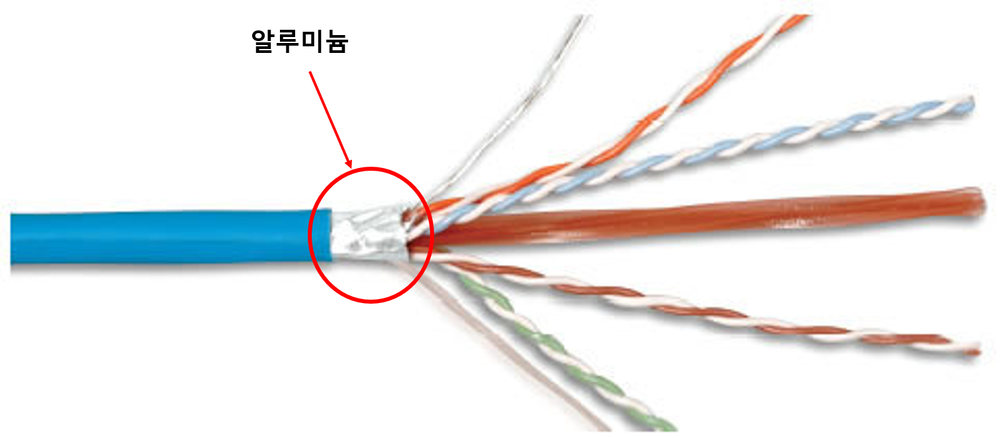
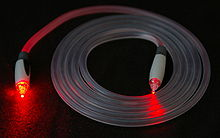

# 3장 - 물리계층 데이터를 전기 신호로 변환하기

# 물리 계층의 역할과 랜 카드의 구조

이미지 출처: [https://www.hakjum.com/TestPool/SubContents/0406/A01/main_01.htm](https://www.hakjum.com/TestPool/SubContents/0406/A01/main_01.htm)

## 데이터가 전기신호로 변환하는 과정

1. 데이터 송신 측 컴퓨터가 전송하는 0과 1의 비트열 데이터는 전기 신호로 변환되어 네트워크를 통해 수신 측 컴퓨터에 도착
2. 수신 측 컴퓨터에서는 전기 신호를 0과 1의 비트열 데이터로 복원
3. 컴퓨터에는 랜카드가 있어 0과 1의 정보가 컴퓨터 내부에 있는랜 카드로 전송되고 랜 카드는 0과 1을 전기 신호로 변환

# 케이블의 종류와 구조

## 트위스트 페어 케이블

트위스트 페어 케이블은 가장 많이 사용하는 케이블이다. 우리가 흔히 공유기에서 사용하는 랜 케이블(랜선)이라고도 부른다.

> LAN(Local Area Network): 근거리 통신망. 건물 안, 특정 지역 등 좁은 범위 내에서 사용하는 네트워크. 이와는 반대로 지리적으로 넓은 범위에 구축된 네트워크를 WAN(Wide Area Network)라고 부른다.

전기 신호는 말 그대로 전기로 만들어진 신호이기 때문에 전자파와 같은 외부 자극에 취약하다. 때문에 다음 그림처럼 작은 자극 하나에도 그 형태가 일그러질 수 있다. 이를 **노이즈**가 발생한다고 한다.

이와 같은 노이즈의 발생을 방지하기 위해 신호를 전달하는 각각의 선들은 보호받아야 한다. 이 때 트위스트 페어 케이블은 어떤 식으로 보호되느냐에 따라 UTP(Unshielded Twist Pair) 케이블, FTP (Foil Screened Twist Pair Cable), STP (Shielded Twist Pair Cable) 케이블로 나뉜다.

---

UTP 케이블은 **실드**(shield)가 없어 보호되지 않는 케이블이다. 실드는 때문에 외부에서 발생하는 노이즈의 영향을 받기 쉽다. 그러나 저렴하기 때문에 일반적으로 많이 사용한다.

> 실드 : 케이블 내부에서 구리선을 금속 호일이나 금속의 매듭과 같은 것으로 감싸 외부에서 발생하는 노이즈를 막는 역할을 한다.

UTP 케이블. 이미지 출처: [https://blog.naver.com/tyghvm100/220249776870](https://blog.naver.com/tyghvm100/220249776870)

---

FTP 케이블은 쉴드 처리는 되어있지 않고, 알루미늄 은박이 4가닥의 선을 감싸고 있는 케이블이다.

UTP 케이블에 비해 절연 기능이 좋고 공장 배선용으로 많이 사용한다.

FTP 케이블. 이미지 출처: https://blog.naver.com/tyghvm100/220249776870

---

STP 케이블은 두 개씩 꼬아 만든 선을 실드로 보호한 케이블이다. 노이즈의 영향을 매우 적게 받지만 비싸기 때문에 보편적으로 사용하지는 않는다.

STP 케이블. 이미지 출처: https://blog.naver.com/tyghvm100/220249776870

---

마지막으로 트위스트 페어 케이블 끝에는 RJ-45라고 부르는 커넥터가 붙는데, 컴퓨터나 공유기 등의 네트워크 기기에 연결하기 위해 사용된다.

RJ-45 커넥터. 이미지 출처 : https://www.cmple.com/cat5e-ethernet-network-patch-cable-350-mhz-rj45-7-feet-blu

---

## **광케이블**

광케이블. 이미지 출처 : https://namu.wiki/w/%ED%8C%8C%EC%9D%BC:minho%20220px-Fiber_optic_illuminated.jpg

데이터 전송을 위해서 [광섬유](https://namu.wiki/w/%EA%B4%91%EC%84%AC%EC%9C%A0)로 만든 케이블이다. 레이저를 이용해서 통신하기 때문에 구리선과는 비교할 수 없을 만큼의 장거리 & 고속 통신이 가능하다.

다만, 광섬유 자체가 유리 재질로 만들어지기에 구부러졌을 때 깨지기가 쉽고, 구리선처럼 자르고 이어붙이는게 되지 않아 손상이 생길 경우 전체를 교체해야 하기에 보수가 어렵다. 또한, 전기 신호를 빛으로 바꾸는 데 트랜시버가 필요하는데 이 트랜시버의 가격이 매우 비싼 편이다.

---

## **다이렉트 케이블 VS 크로스 케이블**

OSI 7계층에서 통신을 할 때 서로 다른 계층 내에서의 통신이 이뤄질 때도 있고 같은 계층에서 통신이 이뤄질 때도 있다. 

때문에 각각의 계층 인터페이스에 따른 데이터 교환 방식이 달라져야 한다. 

여기에서 **MDI**( Medium Dependent Interface)란 개념이 나온다. 

MDI는 매체에 따라 인터페이스가 달라진다는 의미이다. 다음 케이블 도식을 한 번 보자.

구리선 도식

구리선의 좌편과 우편에서 데이터를 송수신 한다고 했을 때 4양측이 같은 계층에 있어 같은 MDI를 사용한다고 가정해보자. 

양측 모두 송신을 위한 구리선을 1,2번으로 사용하고 수신을 위한 구리선을 3,4번으로 사용한다면 데이터를 양쪽에서 송신한다면 중간에서 충돌이 일어날 것이고, 수신 구리선은 송신단과 연결돼있지 않아 평생 데이터를 수신할 수 없을 것이다.

이에 데이터 송수신 측이 서로 어떤 MDI를 사용하는지 파악하고 그에 따른 적절한 케이블 이용이 필요하다. 위의 도식에서 볼 수 있는 것처럼 케이블 안에는 8개의 구리선이 있다. 

그러나 일반적으로 사용되는 구리선은 4개(송신 2개, 수신 2개)일 뿐이다.

송수신에 따른 MDI의 구분은 다음과 같다.

> MDI : 송신 - 1,2번 / 수신 - 3,6번MDI-X : 송신 - 3,6번 / 수신 - 1,2번

이 MDI 구조에 따른 케이블은 다음과 같이 구분된다.

다이렉트 케이블

위의 다이렉트 케이블을 보면 좌측에는 MDI가, 우측에는 MDI-X가 위치해있다.

서로 다른 계층이며, 다른 인터페이스를 사용하고 있다는 의미다.

실제로는 컴퓨터와 스위치(허브)를 연결할 때 사용한다.

크로스 케이블

위의 크로스 케이블을 보면 좌측에는 MDI가, 우측에는 MDI-X가 위치해있다.

서로 같은 계층이기에 같은 인터페이스를 사용한다.

위와 같은 상황일 때 다이렉트 케이블을 사용하면(좌-1번이 우-1번과 연결된 경우) 서로 데이터를 송신하려 하기 때문에 충돌이 일어난다.

크로스 케이블은 주로 컴퓨터 간에 직접 랜 케이블로 연결할 때 사용한다.