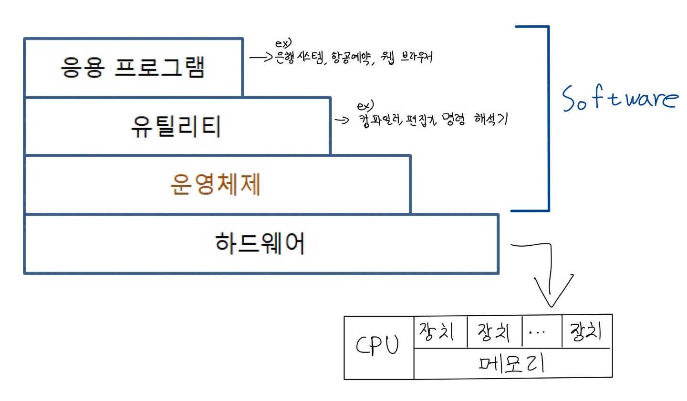

# Section 1. 운영체제의 개념

운영체제는 컴퓨터 사용자와 하드웨어 간의 인터페이스를 담당하는 프로그램이다. 사용자가 응용 프로그램을 실행할 수 있는 기반 환경을 제공하여 컴퓨터를 편리하게 사용할 수 있도록 하는 소프트웨어의 일종이다.

# 1.1 운영체제의 역할

**컴퓨터 시스템의 구성요소**: 사용자, 소프트웨어, 하드웨어

컴퓨터 사용자(응용프로그램 사용자)는 하드웨어보다는 응용 프로그램 관점에서 하드웨어를 이해한다.

- **컴퓨터 사용자**
어떤 일을 수행하기 위해 컴퓨터를 사용하는 사람, 장치, 다른 컴퓨터
- **하드웨어**
연산을 위한 기본 자원을 제공하는 CPU(프로세서), 메모리(기억 장치), 다양한 장치(입출력 장치 등)로 구성
- **소프트웨어**
컴퓨터가 기능 수행하는 데 필요한 프로그램 총징
시스템 소프트웨어, 유틸리티, 응용 프로그램 등으로 구성
- **유틸리티**: 컴퓨터의 여러 처리 과정을 보조하여 시스템을 유지하고 성능을 개선하기 위한 프로그램
- **응용 프로그램**: 어떤 문제를 해결하기 위해 사용자나 전문가에 으ㅣ해 만들어진 프로그램

### 컴퓨터 자원 관리 측면에서 운영체제의 역할

**1) 조정자**

- OS는 컴퓨터 시스템의 하드웨어, 소프트웨어, 데이터로 구분할 수 있는 운영 요소를 적절하게 사용할 수 있도록 제어
- 다른 프로그램이 작업할 수 있는 환경만 제공(직접 수행 X) - 조정자(지휘자) 역할
- 

**2) 자원 관리(할당)자**

- 각 응용 프로그램 실행에 필요한 자원을 관리하고 할당
- 각 프로그램의 이해관계 안에서 자원을 공정하고 효율적으로 운영

**3) 문제 해결 및 사용자 프로그램 제어**

- 핵심 Role1: 다양한 입출력 장치를 동작시키고 제어하는 역할 수행
- 핵심 Role2: 응용 프로그램의 실행 제어를 통한 컴퓨터 시스템의 부적절한 사용 및 오류 방지
- 이를 위해 수행하는 역할
- 하드웨어와 사용자 간의 인터페이스 정의
- 사용자들이 하드웨어를 공동으로 사용하도록 함
- 사용자들이 데이터 공유
- 사용자 간의 자원 관리(할당)자 역할 수행
- 입출력 보조 역할 수행
- 오류 처리

# 1.2 자원 관리

**자원**: 메모리, 프로세스, 장치, 파일  등의 시스템 구성요소  

OS는 프로그램을 실행하는 데 필요한 환경과 자원을 제공하고 관리

제한된 자원을 효율적으로 사용하기 위한 이용율 증가와 오버헤드 최소화 그리고 각각의 응용 프로그램이 서로의 수행 역할을 보호해야 함

### 프로세스 관리

프로세스: 실행 중인 프로그램을 의미하며 하나의 프로세스는 한 시스템에서 작업 단위가 됨
시스템: 프로세스의 집합으로 구성. 운영체제 프로세스와 사용자 프로세스로 분류
기능

- 프로세스와 스레드 스케줄링
- 프로세스 생성과 제거
- 프로세스의 중지와 재수행
- 프로세스 동기화를 위한 기법 제공
- 프로세스 통신을 위한 기법 제공
- 교착상태를 방지하는 기법 제공

### 메모리 관리

메인 메모리와 보조 기억 장치로 구분

1) 메인 메모리 관리

프로세스가 직접 주소로 지정할 수 있는 메모리. 프로세서가 명령어를 수행하려면 명령어가 메인 메모리에 있어야 한다. 프로그램을 수행하려면 프로그램이 절대 주소로 맵핑되어 메인 메모리에 저장되어야 한다. 프로세서 이용률과 컴퓨터 응답 속도를 높이려면 메모리에 프로그램을 몇 개 저장하고 있어야 한다.

- 메모리의 어느 부분이 사용되고 누가 사용하는지를 점검
- 메모리 공간에 어떤 프로세스를 저장할 지를 결정
- 메모리 공간을 할당하고 회수하는 방법 결정

2) 보조기억 장치 관리

프로그램이 실행되는 동안 필요한 데이터와 함께 메인 메모리에 있어야 하지만 메인 메모리 공간은 제한적이다. 모든 데이터와 프로그램을 계속 저장할 수 없기 때문에 컴퓨터 시스템은 보조기억 장치로 디스크를 사용하여 내용을 저장한다. 그러므로 디스크에서의 저장 기법이 매우 중요하다.

운영체제는 디스크 관리를 위해 다음 기능을 담당한다.

- 비어 있는 공간 관리
- 저장 장소 할당
- 디스크 스케줄링

### 장치 관리

사용자가 특정 하드웨어 장치(입출력 장치 등)를 세부적이고 복잡한 기계로 느끼지 않고 포괄적 기계로 인식하도록 하여 원활한 수행이 되어야한다.

유닉스에서 입출력 장치의 구체 사항은 입출력 시스템에 의해 대부분 숨겨져 있다.

OS는 입출력 시스템을 관리하기 위해 다음 기능을 담당한다.

- 임시 저장(buffer-caching) 시스템
- 일반적인 장치 드라이버 인터페이스
- 특정 하드웨어 장치를 위한 드라이버

### 파일 관리

컴퓨터는 다양한 형태, 즉 디스크, CD 등 일반 저장 형태로 정보를 저장한다. 이런 장치의 효율적인 사용을 위해 운영체제는 단일화된 정보 저장 형태를 유지 제공하고 있다.

OS는 파일 관리를 위해 다음 기능을 담당한다.

- 파일 생성과 제거
- 디렉터리 생성과 삭제
- 보조기억 장치에 있는 파일의 맵핑
- 안전한 저장 매체에 파일 저장

### 기타 관리 기능

1) 보호 시스템

OS는 메모리, 파일 프로세서 등 자원은 OS가 적절한 권한을 부여한 프로세스만 수행할 수 있도록 다른 사용자의 프로그램으로부터 보호되어야 한다.

2)네트워킹

시스템에 있는 프로세서는 다양한 방법으로 구성될 수 있는 통신 네트워크를 통해 연결된다.
통신 네트워크를 설계할 때는 결로 설정, 접속 정책, 충돌 보안 등의 문제를 고려해야 한다.

3) 명령 해석기

사용자가 입력한 여러 가지 명령은 제어 문장에 의해 OS에 전달되는데, 이 전달을 명령 해석기가 담당한다. 사용자에게 컴퓨터의 프로그램을 쉽고 효율적으로 실행할 수 있는 환경을 제공한다.

# 1.3 운영체제의 목적

운영체제는  '1. 사용자 편리성 제공', '2. 자원관리 및 오류제어', '3. 시스템 성능 향상'이라는 세 가지 주요 목적을 위해 발전해왔다. 그러다보니 항상 시스템 확장성을 고려하여 발전하는 경향을 보인다.

### 사용자에게 편리한 환경 제공

운영체제는 사용자가 프로그램을 개발하고 실행하는 데 있어 좀 더 익숙한 환경을 제공하여 컴퓨터를 좀 더 편리하게 사용하게 해준다.

ex) 개인용 컴퓨터의 GUI 환경

### 자원관리 및 오류제어

컴퓨터 시스템 하드웨어 및 소프트웨어 자원을 여러 사용자에게 효율적으로 할당하고 관리하여 시스템의 성능을 향상시킨다.

제어 프로그램으로서의 서비스 즉 입출력 장치 제어와 동작, 시스템 오류 예방 등을 통해 사용자 프로그램의 오류나 잘못된 자원 사용을 감시하고 입출력 장치 드으이 자원에 대한 연산과 제어를 관리한다.

### 시스템 성능 향상

OS는 자원을 효과적으로 사용하기 위해 각 프로그램을 유기적으로 결합하여 시스템의 전체 성능을 향상시키는 방향으로 설계된다.

1) 처리 능력 향상

시스템의 생산성을 나타내며 단위 시간당 처리하는 작업량이다.

2) 신뢰도 향상

하드웨어 및 소프트웨어가 실패 없이 주어진 기능을 수행할 수 있는 능력이다.

3) 응답 시간 단축

사용자가 시스템에 작업을 의뢰한 후 반응을 얻을 때까지의 시간이다.

시분할 방식 시스템은 응답 시간이라 하고, 일괄 처리 시스템에서는 턴어라운드타임이라 한다.

4) 사용가능도 증대

가동률이라고도 하며 사용자가 일정 기간 동안 컴퓨터를 실제로 사용한 시간이다. 고장과 오류가 발생해도 영향을 감소시켜 시스템 전체를 중단시키지 않고 운영함을 뜻한다.