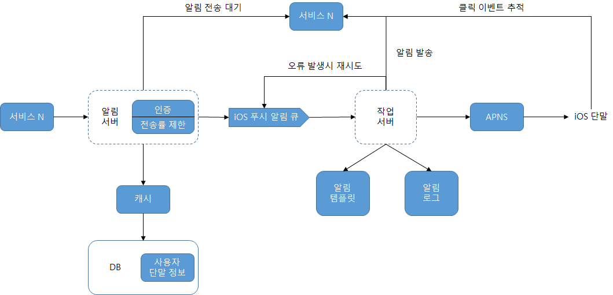

# 10장. 알림 시스템 설계

알림 시스템은 고객에게 중요할 만한 정보를 비동기적으로 제공하며, 모바일 푸시 알림, SMS 메시지, 이메일 세 가지 분류가 있다.

# 1단계 문제 이해및 설계 범위확정

백만 건 이상의 알림을 처리하는 확장성 높은 시스템을 구축해야 한다. 본 설계안에는 다음 요건이 필요하다.

- 푸시 알림, SMS 메시지, 이메일을 지원해야 한다.
- 연성 실시간(soft real-time) 시스템을 지원한다. 알림은 빨리 전달되어야하지만 약간의 지연은 무방하다.
- ios단말,안드로이드 단말, 랩톱/데스크톱 지원해야 한다.
- 알림을 만드는 주체는 클라이언트 애플리케이션 프로그램 또는 서버이다.
- 알림을 받지 않도록 설정(opt-out) 가능하다.
- 첫만 건의 모바일 푸시 알림, 백만 건의 SMS 메시지, 5백만 건의 이메일을 보낼 수 있어야 한다.

## 개략적 설계안 제시 및 동의 구하기

- 알림 유형별 지원 방안
- 연락처 정보 수집 절차
- 알림 전송 및 수신 절차

## 알림 유형별 지원 방안

### iOS 푸시 알림

iOS에서 푸시 알림을 보내기 위해서는 세 가지 컴포넌트가 필요하다.

- 알림 제공자(provider): 알림 요청(notification rquest)을 만들어 애플 푸시 알림 서비스(APNS: Apple Push Notification Service)로 보내는 주체다. 다음 데이터가 필요하다.
- 단말 토큰(device token): 알림 요청을 보내는 데 필요한 고유 식별자
- 페이로드(payload): 알림 내용을 담은JSON딕셔너리(dictionary)
- APNS: 애플이제공하는 원격 서비스. 푸시 알림을 iOS 장치로 보내는 역할을 담당한다.
- iOS 단말(iOS device): 푸시 알림을 수신하는 사용자 단말이다.

### 안드로이드푸시 알림

APNS 대신 FCM(Firebase CloudMessaging)을 사용한다.

### SMS 메시지

보통 Twilio, Nexmo같은 제 3사업자의 서비스를 많이 이용한다. 대부분 상용 서비스다.

### 이메일

대부분의 회사는 고유 이메일 서버를 구축할 역량은 갖추고 있다. 그럼에도 많은 회사가 상용 이메일 서비스를 이용한다. 

유명한 서비스로 Sendgrid, Mailchimp 등이 있다. 전송 성공률도 높고,데이터 분석 서비스도 제공한다.

## 연락처 정보 수집 절차

알림을 보내려면 모바일 단말 토큰, 전화번호, 이메일 주소 등의 정보가 필요하다.

사용자가 우리 앱을 설치하거나 처음으로 계정을 등록하면 API 서버는 해당 사용자의 정보를 수집하여 데이터베이스에 저장한다.

## 알림 전송 및 수신 절차

### 개략적설계안

- 서비스 1...서비스 N : 서비스는 각각 마이크로서비스일 수도 있고, 크로잡일 수도 있고, 분산 시스템컴포넌트일 수도 있다. 사용자에게 납기일을 알리고자 하는 과금 서비스(billing service), 배송 알림을 보내려는 쇼핑몰 웹사이트 등이 그 예이다.
- 알림 시스템(notification system): 알림 전송/수신 처리의 핵심이다. 이 시스템은 서비스에 알림 전송을 위한 API를 제공해야 하고, 제 3자 서비스에 전달할 알림 페이로드(payload)를 만들어 낼 수 있어야 한다.
- 제 3자 서비스(third party services): 이 서비스들은 사용자에게 알림을 실제로 전달하는 역할을 한다. 쉽게 새로운 서비스를 통합하거나 기존 서비스를 제거할 수 있는 확장성(extensibility)를 유의해야 한다. 어떤 서비스는 다른 시장에서는 사용할 수 없을 수있다는 점을 유의해야한다.
- 단말: 사용자는 자기 단말에서 알림을 수신한다.

서버를 한대만 이용할 경우 문제

- SPOF(Single-Point-Of-Failure): 서버에 장애가 생기면 전체 서비스의 장애로 이어진다.
- 규모 확장성: DB나 캐시 등 중요 컴포넌트의 규모를 개별적으로 늘릴 방법이 없다.
- 성능 병목: 알림 처리는 자원을 많이 쓸 수 있다. 따라서 모든 것을 한 서버로 처리하면 사용자 트래픽이 많이 몰리는 시간에 시스템이 과부화 상태에 빠질 수 있다.

### 개략적설계안(Advanced)

**추가 설정**

- DB와 캐시를 주 서버에서 분리한다.
- 알림 서버를 증설하고 자동으로 수평적 규모 확장이 이루어질 수 있도록 한다.
- 메시지 큐를 이용해 시스템 컴포넌트 사이의 강한 결합을 끊는다.

**설계안**

- 서비스 1...서비스 N : 알림 시스템 서버의 API를 통해 알림을 보낼 서비스들
- 알림 서버(notification server) 제공 기능
- 알림 전송 API : 스팸 방지를 위해 보통 사내 서비스 또는 인증된 클라이언트만 이용 가능
- 알림 검증(validation): 이메일 주소, 전화번호 등에 대한 기본적 검증 수행
- DB 또는 캐시 질의: 알림에 포함시킬 데이터를 가져오는 기능
- 알림 전송: 알림 데이터를 메시지 큐에 넣음. 알림을 병렬적으로 처리 가능.
- 캐시: 사용자 정보, 단말 정보, 알림 템플릿 등 캐시
- DB: 사용자, 알림, 설정 등 다양한 정보 저장
- 메시지 큐(message queue): 시스템 컴포넌트 간 의존성을 제거하기 위해 사용. 다량의 알림이 전송되어야 하는 경우를 대비한 버퍼 역할 역시 수행. 알림 종류별로 별도 메시지 큐 사용 가능.
- 작업 서버(workers): 메시지 큐에서 전송할 알림을 꺼내서 제 3자 서비스로 전달
- 제3자 서비스(third-party service):
- 단말

Advanced 설계안의 알림 전송 방식

1. API를 호출하여 알림 서버로 알림을 보낸다.
2. 알림 서버는 사용자 정보, 단말 토큰, 알림 설정 같은 메타데이터(metadata)를 캐시나 DB 안에서 가져온다.
3. 알림 서버는 전송할 알림에 맞는 이벤트를 만들어서 해당 이벤트를 위한 큐에 넣는다.
4. 작업 서버는 메시지 큐에서 알림 이벤트를 꺼낸다.
5. 작업 서버는 알림을 제3자 서비스로 보낸다.
6. 제3자 서비스는 사용자 단말로 알림을 전송한다.

# 3단계 상세 설계

- 안정성(reliability)
- 추가 고려서항: 알림 템플릿, 알림 설정, 전송률 제한, 재시도 매커니즘, 보안, 알림 모니터링, 이벤트 추적 등

## 안정성

### 데이터 손실 방지

알림은 지연되거나 순서가 틀려도 괜찮지만 사라지면 곤란하다. 이를 위해 재시도 매커니즘(retry mechanism)이 필요하다. 이를 위해 알림 로그(notification log) 데이터베이스를 이용할 수 있다.

### 알림 중복 전송 방지

대부분 알림은 딱 한번만 전송되겠지만, 가끔 알림이 중복 전송될수도 있다.

중복을 탐지하는 매커니즘을 구축하고 오류를 처리해야 한다. 

한 예로 알림 도착 시 그 이벤트 ID를 검사하여 이전에 본 적이 있는 이벤트인지 파악할 수 있다.

## 추가로 필요한 컴포넌트 및 고려사항

알림 템플릿, 알림 설정, 이벤트 추적, 시스템 모니터링, 처리율 제한 등의 컴포넌트

### 알림 템플릿

알림 메시지 대부분은 형식이 비슷하다. 알림 템플릿은 알림 메시지의 모든 부분을 처음부터 다시 만들 필요 없도록 해준다.

### 알림 설정

알림은 사용자에게 스트레스를 줄 수 있다. 따라서, 웹사이트 또는 앱 등에서는 알림 설정을 상세히 조정할 수 있도록 한다.

특정 종류의 알림을 보내기 전에 반드시 해당 사용자가 해당 알림을 켜두었는지 확인해야 한다.

### 전송률 제한

사용자에게 너무 많은 알림을 보내지 않도록 하는 방법 중 하나는 알림 빈도를 제한하는 것이다.

### 재시도 방법

제3자 서비스가 알림 전송에 실패하면, 해당 알림을 재시도 전용 큐에 넣는다.

### 푸시 알림과 보안

알림 전송 API는 appKey와 appSecret을 사용하여 보안을 유지한다. 따라서 authenticated, verified 클라이언트만 해당 API를 사용하여 알림을 보낼 수 있다.

### 큐 모니터링

큐에 쌓인 알림의 개수를 파악해야 한다. 이 수가 너무 크면 작업 서버들이 이벤트를 빠르게 처리하고 있지 못하다는 뜻이다. 

### 이벤트 추적

알림 확인율, 클릭율, 실제 앱 사용으로 이어지는 비율과 같은 데이터는 사용자를 파악하는데 필요하다.

analytics 서비스는 보통 이벤트 추적 기능도 제공한다. 알림 시스템을 만들려면 데이터 분석 서비스와도 통합해야 한다.

## 수정된 설계안

# 4단계 마무리

이번 장에서 핵심 주제

- 안정성(reliability)
- 보안(security)
- 이벤트 추적 및 모니터링
- 사용자 설정
- 전송률 제한