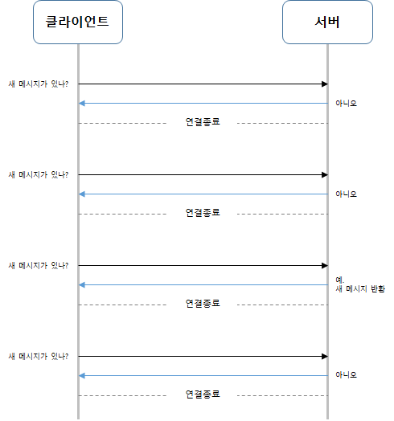

# 12장. 채팅 시스템 설계

# 1단계 문제 이해 및 설계 범위 확정

- 응답지연이 낮은 일대일 채팅 기능
- 최대 100명까지 참여할 수 있는 그룹 채팅 기능
- 사용자의 접속상태 표시 기능
- 다양한 단말 지원. 하나의 계정으로 여러단말에 동시 접속 지원
- 푸시 알림
- 모바일, 앱 단말 지원

# 2단계 개략적 설계안 제시 및 동의 구하기

채팅 시스템은 모바일 앱이거나 웹 애플리케이션이다.

클라이언트는 서로 직접 통신하지 않고, 채팅 서비스와 통신한다.

**채팅 서비스 기능**

- 클라이언트로부터 메시지 수신
- 메시지 수신자(recipient) 결정 및 전달
- 수신자가 접속 상태가 아닌 경우에는 접속할 때까지 해당 메시지 보관

어떤 통신 프로토콜을 사용할지 골라야한다.

**송신 시나리오**

메시지 송신 클라이언트(sender): 이번 단계에서는 수신 클라이언트에게 전달할 메시지를 채팅 서비스에 보낼 때, HTTP 프로토콜 사용한다.

HTTP를 사용하게 되면, 클라이언트는 채팅 서비스에 HTTP 프로토콜로 연결한 다음 메시지를 보내어 수신자에게 해당 메시지를 전달하라고 알린다. 채팅 서비스와의 접속에는 keep-alive 헤더를 사용하면 효율적인데, 클라이언트와 서버 사이의 연결을 끊지 않고 계속 유지할 수 있다.

TCP 접속 과정에서 발생하는 핸드셰이크(hand-shake) 횟수를 줄일수도 있다.

**수신 시나리오**

송신 시나리오보다 복잡하다. HTTP는 클라이언트가 연결을 만드는 프로토콜이며, 서버에서 클라이언트로 임의 시점에 메시지를 보내는 데는 쉽게 쓰일 수 없다. 서버가 연결을 만드는 것처럼 동작할 수 있도록 하기 위해 폴링(Polling), 롱 폴링(Long Polling), 웹소켓(WebSocket) 등의 기술이 쓰인다.

## 폴링

서버에게 새 메시지가 있느냐고 물어보는 방법이다.

답해줄 메시지가 없는 경우에 서버 자원이 불필요하게 낭비된다.

## 롱 폴링

## 롱 폴링

새 메시지가 반환되거나 타임아웃 될 때까지 연결을 유지한다.

새 메시지를 받으면 기존 연결을 종료하고 서버에 새로운 요청을 보내어 모든 절차를 다시 시작한다.

**약점**

- Round robin 알고리즘을 사용하는 경우, sender와  receiver가 같은 채팅 서버에 접속하게 되지 않을 수 있다.
- 서버 입장에서는 클라이언트가 연결을 해제했는지 아닌지 알 좋은 방법이 없다.
- 타임아웃이 일어날 때마다 주기적으로 서버에 다시 접속하기에 여전히 비효율적이다.

## 웹소켓

서버가 클라이언트에게 비동기(async) 메시지를 보낼 때 가장 널리 사용하는 기술이다.

웹소켓 연결은 클라이언트가 시작한다. 한번 맺어진 연결은 항구적이며 양방향이다.

처음에는 HTTP 연결이지만 특정 핸드셰이크 절차를 거쳐 웹소켓 연결로 업그레이드된다. 연결된 이후에 서버는 클라이언트에게 비동기적으로 메시지를 전송할 수 있다.

웹소켓은 HTTP와 HTTPS처럼 80이나 443과 같은 기본 포트를 사용하기에 방화벽 환경에서도 잘 작동한다.

### 개략적 설계안

채팅 시스템은 대부분 세 부분으로 나누어 볼 수 있다.

Stateless 서비스, Stateful 서비스, 제 3자 서비스 연동

**무상태Stateless 서비스**

서버에 세션Session 상태가 없는 것이다.

각각의 요청을 독립적인 트랜잭션으로 취급하는 통신 프로토콜로, 통신이 독립적인 쌍의 요청과 응답을 이룰 수 있게 하는 방식이다. 무상태 프로토콜은 서버가 복수의 요청 시간대에 각각의 통신 파트너에 대한 세션 정보나 상태 보관을 요구하지 않는다.

무상태 서비스는 로드밸런스 뒤에 위치하여 요청을 경로에 맞는 서비스로 정확하게 전달하게 한다. 

**상태유지Stateful 서비스**

본 설계안에서 유일하게 상태 유지가 필요한 서비스는 채팅 서비스다. 각 클라이언트가 채팅 서버와 독립적인 네트워크 연결을 유지해야 하기 때문이다. 클라아이너트는 보통 서버가 살아있는 한 다른 서버로 연결을 변경하지 않는다.

특정 서버에부하가 몰리지 않도록해야한다.

**제 3자 서비스 연동**

가장 중요한 서드파티 서비스는 푸시 알림이다.

**규모 확장성**

서버한대로 얼마나많은 접속을 동시에 허용할 수 있는지 따져봐야 한다.

SPOF 주의

- 채팅 서버와 웹소켓 연결은 끊지 않고 유지해야 한다.
- 채팅 서버는 클라이언트 사이에 메시지를 중계하는 역할을 담당한다.
- 접속상태 서버(presence server)는 사용자의 접속 여부를 관리한다.
- API 서버는 로그인, 회원가입, 프로파일 변경 등 그 외 나머지 전부를 처리한다.
- 알림 서버는 푸시 알림을 보낸다.
- 키-값 저장소(key-value store)에는 채팅 이력(chat history)을 보관한다. 시스템에 접속한 사용자는 이전 채팅 이력을 전부 보게 될 것이다.

**저장소**

채팅 시스템이 다루는 데이터 종류

1. 사용자 프로파일, 설정, 친구목록처럼 일반적인 데이터. 안정성을 보장하는 관계형 데이터베이스에 보관한다.
다중화(replication)와 샤딩(sharding)은 이런 데이터의 가용성과 규모확장성을 보증하기 위해 보편적으로 사용되는 기술이다.
2. 채팅 시스템의 고유한 데이터인 채팅 이력(chat history). 이 데이터를 어떻게 보관할지 결정하려면 읽기/쓰기 연산을 이해해야 한다.
- 채팅 이력 데이터량은 엄청나다. 페북 메신저나 왓츠앱은 매일 600억(billion)개의 메시지를 처리한다.
- 이 가운데 빈번하게 사용되는 것은 주로 최근에 주고받은 메시지다. 대부분의 사용자는 오래된 메시지는 들여다보지 않는다.
- 사용자는 대체로 최근에 주고받은 메시지 데이터만 보게 된다.
- 검색 기능을 이용하거나 특정 사용자가 언급mention된 메시지를 보거나 특정 메시지로 점프jump하거나 무작위적인 데이터 접근을 할 수 있다.
- 1:1 채팅 앱의 경우 읽기:쓰기 비율은 대략 1:1 정도다.

이 모두를 지원할 데이터베이스를 고르는 것은 아주 중요한 일이다. 본 설계안의 경우에는 키-값 저장소를 추천할 것이다.

- 키-값 저장소는 수평적 규모확장(horizontal scaling)이 쉽다.
- 키-값 저장소는 데이터 접근 지연시간(latency)이 낮다.
- 관계형 데이터베이스는 데이터 가운데 롱 테일(long tail)에 해당하는 부분을 잘 처리하지 못하는 경향이 있다. 인덱스가 커지면 데이터에 대한 무작위적 접근(random access)을 처리하는 비용이 늘어난다.
- 이미 많은 안정적인 채팅 시스템이 키-값 저장소를 채택하고 있다. 페이스북 메신저는 HBaase를, 디스코드는 카산드라Cassandra 이용중이다.

### 데이터 모델

키-값 저장소를 데이터 계층 기술로 사용하기로 했으니, 메시지 데이터를 어떻게 보관할 것인지 자세히 살펴보도록 하자.

**1:1 채팅을 위한 메시지 테이블**

그림 12-9는 1:1 채팅을 지원하기 위한 메시지 테이블의 사례다.

이 테이블의 기본 키는 message_id로, 메시지 순서를 쉽게 정할 수 있도록 하는 역할도 담당한다.

created_at을 사용하여 메시지 순서를 정할 수는 없는데, 서로 다른 두 메시지가 동시에 만들어질 수도 있기 때문이다.

| message |  |
| --- | --- |
| message_id | bigint |
| message_from | bigint |
| message_to | bigint |
| content | text |
| created_at | timestamp |

**그룹 채팅을 위한 메시지 테이블**

그림 12-10은 그룹 채팅을 위한 메시지 테이블의 사례다. (channel_id, message_id)의 복합키(composite key)를 기본 키로 사용한다.

여기서 채널(channel)은 채팅 그룹과 같은 뜻이다. channel_id는 파티션 키(partition key)로도 사용할 것인데, 그룹 채팅에 적용될 모든 질의는 특정 채널을 대상으로 할 것이기 때문이다.

| group message |  |
| --- | --- |
| channel_id | bigint |
| message_id | bigint |
| message_to | bigint |
| content | text |
| created_at | timestamp |

**메시지 ID** 

message_id는 메시지들의 순서도 표현할 수 있어야 한다. 그러기 위해서는 다음과 같은 속성을 만족해야 할 것이다.

조건

- message_id의 값은 고유해야 한다(uniqueness).
- ID 값은 정렬 가능해야 하며시간 순서와 일치해야 한다. 즉, 새로운 ID는 이전 ID보다 큰 값이어야 한다.

두 조건을 만족시킬 방법

- RDBMS라면 auto_increment 사용할 수 있다. 그러나 NoSQL은 보통 auto_increment를 제공하지 않는다.
- 스노플레이크 같은 전역적 64-bit 순서 번호(sequence number)생성기를 이용하는 것이다.
- 지역적 순서 번호생성기(local sequence number generator)를 이용하는 것이다.

# 상세 설계

## 서비스 탐색Service discovery

클라이언트에게 가장 적합한 채팅 서버 추천한다. 이 때 사용되는 기준으로는 클라이언트의 위치(geographical location), 서버의 용량(capacity) 등이 있다.

오픈 소스 솔루션(ex. 아파치 주키퍼) - 사용 가능한 모든 채팅 서버를 등록시켜 두고, 클라이언트가 접속을 시도하면 사전에 정한 기준에 따라 최적의 채팅 서버를 골라준다.

1. 사용자 A가 시스템에 로그인을 시도한다.
2. 로드밸런서가 로그인 요청을 API 서버들 가운데 하나로 보낸다.
3. API 서버가 사용자 인증을 처리하고 나면 서비스 탐색 기능이 동작하여 해당 사용자를 서비스할 최적의 채팅 서버를 찾는다. 이 예제의 경우에는 채팅 서버 2가 선택되어 사용자 A에게 반환되었다고하겠다.
4. 사용자 A는 채팅 서버 2와 웹소켓 연결을 맺는다.

## 메시지 흐름

**1:1 채팅 메시지 처리 흐름**

1. 사용자 A가 채팅 서버 1로 메시지 전송
2. 채팅 서버 1은 ID 생성기를 사용해 해당 메시지의 ID 결정
3. 채팅 서버 1은 해당 메시지를 메세제 동기화 큐로 전송
4. 메시지가 키-값 저장소에 보관됨
5. (a) 사용자 B가 접속 중인 경우 메시지는 사용자 B가접속 중인 채팅 서버 (본 예제의 경우에는 채팅 서버 2)로 전송됨 (b) 사용자 B가 접속 중이 아니라면 푸시 알림 메시지를 푸시 알림 서버로 보냄
6. 채팅 서버 2는 메시지를 사용자 B에게 전송. 사용자 B와 채팅 서버 2 사이에는 웹소켓 연결이 있는 상태이므로 그것을 이용

### 여러 단말 사이의 메시지 동기화

채팅 서버 1과 사용자 A의 단말 사이에 웹소켓 연결이 만들어져 있다. 랩톱에서 로그인한 결과로 역시 별도 웹소켓 채팅 서버 1에 연결되어 있는 상황이다.

각 단말은 cur_max_message_id라는 변수를 유지하는데, 해당 단말에서 관측된 가장 최신 메시지의 ID를 추적하는 용도다.

새 메시지

- 수신자 ID가 현재 로그인한 사용자 ID와 같다.
- 키-값 저장소에 보관된 메시지로서, 그 ID가 cur_max_message_id보다 크다.

### 소규모 그룹 채팅에서의 메시지 흐름

1:1 채팅에 비해 그룹 채팅에서의 메시지 흐름은 조금 더 복잡하다.

그룹에 3명의 사용자가 있다고 하자. 우선 사용자 A가 보낸 메시지가 사용자 B와 C의 메시지 동기화 큐(message sync queue)에 복사된다. 이 큐를 사용자 각각에 할당된 메시지 수신함 같은 것으로 생각해도 무방할 것이다. 이 설계안은 소규모 그룹 채팅에 적합한데 그 이유는 다음과 같다.

- 새로운 메시지가 왔는지 확인하려면 자기 큐만 보면 되니까 메시지 동기화 플로가 단순하다.
- 그룹이 크지 않으면 메시지를 수신자별로 복사해서 큐에 넣는 작업의 비용이 문제가 되지 않는다.

위챗이 이런 접근법을 사용한다. 그룹의 크기는 500명으로 제한하고 있다. 많은 사용자를 지원해야 하는 경우라면 똑같은 메시지를 모든 사용자의 큐에 복사하는게 바람직하지 않을 것이다.

한 수신자는 여러 사용자로부터 오는 메시지를 수신할 수 있어야 한다. 따라서 각 사용자의 수신함, 즉 메시지 동기화 큐는 그림과 같이 여러 사용자로부터 오늘 메시지를 받을 수 있어야 한다.

## 접속상태 표시

개략적 설계안에서는 접속상태 서버(presence server)를 통해 사용자의 상태를 관리한다고 했었다. 접속상태 서버는 클라이언트와 웹소켓으로 통신하는 실시간 서비스의 일부라는 점에 유의하라.

### 사용자 로그인

클라이언트와 실시간 서비스(real-time service) 사이에 웹소켓 연결이 맺어지고 나면 접속상태 서버는 A의 상태와 last_active_at 타임스탬프 값을 키-값 저장소에 보관한다. 이 절차가 끝나고 나면 사용자는 접속 중인 것으로 표시될 것이다.

### 로그아웃

...

### 접속 장애

사용자의 인터넷 연결이 끊어지면 클라이언트-서버 웹소켓 같은 지속성 연결도 끊어진다. 이런 장애에 대응하는 간단한 방법은 사용자를 오프라인 상태로 표시하고 연결이 복구되면 온라인 상태로 변경하는 것이다.

단점: 짧은 시간 동안 인터넷 연결이 끊어졌다 복구되는 일은 흔하기에 매번 접속상태를 변경하다면 비효율적이고 사용자 경험 측면에서도 바람직하지 않다.

박동(heartbeat) 검사

온라인 상태의 클라이언트로 하여금 주기적을 ㅗ박동 이벤트를 접속상태 서버로 보내도록 하고, 마지막 이벤트를 받은 지 x초 이내에 또 다른 박동 이벤트 메시지를 받으면 해당 사용자의 접속상태를 계속 온라인으로 유지한다.

### 상태 정보의 전송

상태정보 서버는 발행-구독 모델(publish-subscribe model)을 사용하는데, 각각의 친구관계마다 채널을 하나씩 둔다. 가령 사용자 A의 접속상태가 변경되었다고 하자. 그 사실을 세 개 채널, 즉 A-B, A-C, A-D에 쓰는 것이다. 각각의 B, C, D 사용자가 이 채널을 구독하도록 하면 상태정보 변화를 쉽게 통지받을 수 있다.

다만, 그룹 크기가 더 커지면 이런 식으로 접속상태 변화를 알려서는 비용이나 시간이 많이 들게 된다.

# 4단계 마무리

- 채팅 앱을 확장하여 사진이나 비디오 등의 미디어를 지원하도록 하는 방법
- 종단 간 암호화
- 캐시
- 로딩 속도 개선
- 오류 처리
    - 채팅 서버 오류
    - 메시지 재전송