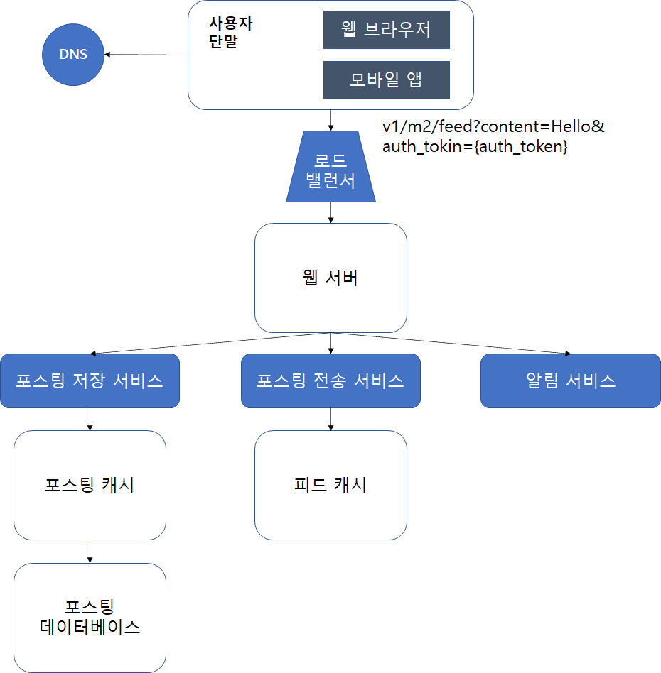

# 11장. 뉴스 피드 시스템 설계

뉴스피드: 페이스북에서 설명한 바에 따르면 홈페이지 중앙에 지속적으로 업데이트되는 스토리들. 사용자 상태 정보 업데이트, 사진, 비디오, 링크, 앱 액티비티 등을 의미

# 1단계 문제 이해 및 설계 범위 확정

- 모바일 앱과 웹 둘 다 지원해야 함
- 새로운 스토리 업로드, 지인의 스토리 관찰 가능
- 시간 흐름 역순으로 정렬 및 표시
- 한 명의 사용자는 최대 5,000명의 친구 팔로우 가능
- 트래픽은 매일 천만 명(10million DAU) 
- 스토리에는 이미지나 비디오 등의 미디어 파일 업로드 가능

# 2단계. 개략적 설계안 제시 및 동의 구하기

- 피드발행:  사용자가 스토리를 포스팅하면 해당 데이터를 캐시와 데이터베이스에 기록한다. 새 포스팅은 친구의 뉴스피드에도 전송된다.
- 뉴스피드 생성: 지면 관계상 뉴스피드는 모든 친구의 포스팅을 시간 흐름 역순을 모아서 만든다고 가정한다.

## 뉴스 피드 API

뉴스 피드 api는 HTTP 프로토콜 기반이고, 상태 정보를 업데이트하거나, 뉴스피드를 가져오거나, 친구를 추가하는 등의 다양한 작업을 수행하는데 사용한다.

## 피드 발행 API

새 스토리를 포스팅하기 위한 API다. HTTP POST 형태로 요청을 보내면 된다.

POST /v1/me/feed

**인자**

- 바디(body): 포스팅 내용에 해당한다.
- Authorization 헤더: API 호출을 인증하기 위해 사용한다.

## 피드 읽기 API

뉴스 피드를 가져오기 위한 API

GET/v1/me/feed

**인자**

- Authorization 헤더: API 호출을 인증하기 위해 사용한다.

## 피드 발행

- 사용자: 모바일 앱이나 브라우저에서 새 포스팅을 올리는 주체. POST /v1/me/feed API 사용
- 로드밸런서(load balancer): 트래픽을 웹 서버들로 분산
- 웹 서버: HTTP 요청을 내부 서비스로 중계하는 역할 담당
- 포스팅 저장 서비스(post service): 새 포스팅을 데이터베이스와 캐시에 저장
- 포스팅 전송 서비스(fanout service): 새 포스팅을 친구의 뉴스 피드에 푸시(push)
뉴스 피드 데이터는 캐시에 보관하여 빠르게 읽을 수 있음
- 알림 서비스(notification service): 친구들에게 새 포스팅이 올라왔음을 알리거나, 푸시 알림을 보내는 역할 담당

## 뉴스 피드 생성

- 사용자: 뉴스 피드를 읽는 주체다. GET /v1/me/feed API를 이용한다.
- 로드 밸런서: 트래픽을 웹 서버들로 분산한다.
- 웹 서버: 트래픽을 뉴스 피드 서비스로 보낸다.
- 뉴스 피드 서비스(news feed service): 캐시에서 뉴스 피드를 가져오는 서비스다.
- 뉴스 피드 캐시(news feed cache): 뉴스 피드를 렌더링할 때 필요한 피드 ID를 보관한다.

# 3단계 상세 설계

## 피드 발행 흐름 상세 설계

대부분의 컴포넌트는 개략적 설계안에서 다룬 정도로 충분할 것이라, 웹 서버와 포스팅 전송 서비스에 초점을 맞추었다.

### 웹 서버

웹 서버는 클라이언트와 통신할 뿐 아니라 인증이나 처리율 제한 등의 기능도 수행한다. 올바른 인증 토큰을 Authorization 헤더에 넣고 API를 호출하는 사용자만 포스팅을 할 수 있어야 한다. 또한, 스팸을 막고 유해한 콘텐츠가 자주 올라오는 것을 방지하기 위해서 특정 기간동안 한 사용자가 올릴 수 있는 포스팅의 수에 제한을 두어야 한다.

### 포스팅 전송(팬아웃) 서비스

포스팅 전송, 즉 팬아웃(fanout)은 어떤 사용자의 새 포스팅을 그 사용자와 친구 관계에 있는 모든 사용자에게 전달하는 과정이다. 팬아웃에는 두가지 모델이 있는데 하나는 쓰기 시점에 팬아웃(fanout-on-write)하는 모델이고(push 모델), 다른 하나는 읽기 시점에 팬아웃(fanout-on-read)모델(pull 모델)이다.

쓰기 시점에 팬아웃하는 모델

새로운 포스팅을 기록하는 시점에 뉴스 피드를 갱신한다.

**장점**

- 뉴스 피드가 실시간으로  갱신되며 친구 목록에 있는 사용자에게 즉시 전송
- 새 포스팅이 기록되는 순간에 뉴스 피드가 이미 갱신되므로(pre-computed) 뉴스 피드를 읽는 데 드는 시간 감소

**단점**

- 친구가 많은 사용자의 경우 친구 모두의 뉴스 피드를 갱신하는 데 많은 시간 소요될 수 있음(hotkey issue)
- 서비스를 자주 이용하지 않는 사용자의 피드까지 갱신해야 함

읽기 시점에 팬아웃하는 모델

피드를 읽어야 하는 시점에 뉴스 피드를 갱신하는 on-demand 모델

**장점**

- 비활성화된 사용자, 서비스에 거의 로그인하지 않는 사용자의 경우에 유리
로그인하기 전까지 어떤 컴퓨팅 자원도 소모하지 않음
- hotkey 문제 발생하지 않음

**단점**

- 뉴스 피드를 읽는 데 많은 시간 소요

두 가지 방법을 결합하여 설계안 제시

- 뉴스 피드를 빠르게 가져올 수 있도록 하는 것은 중요하므로 대부분의 사용자에 대해서는 쓰기 시점 팬아웃(푸시 모델) 사용
- 친구 또는 팔로워가 많은 사용자의경우 팔로어에게 해당 사용자의 포스팅을 필요할 때 가져가도록 하는 읽기 시점에 팬아웃(풀 모델) 사용
- 안정 해시(consistent hashing)를 통해 요청과 데이터를 보다 고르게 분산하여 하기 문제 감소

팬아웃 서비스 동작 방식

1. 그래프 데이터베이스에서 친구 ID 목록을 가져옴
2. 사용자 정보 캐시에서 친구들의 정보를 가져옴
일부 필터링 작업 진행
3. 친구 목록과 새 스토리의 포스팅 ID를 메시지 큐에 넣음
4. 팬아웃 작업 서버가 메시지 큐에서 데이터를 꺼내어 뉴스 피드 데이터를 뉴스 피드 캐시에 넣음
뉴스 피드 캐시는 <포스팅 ID, 사용자 ID>의 순서쌍을 보관하는 매핑 테이블

| post_id1 | user_id1 |
| --- | --- |
| post_id2 | user_id2 |
| post_id3 | user_id3 |
| post_id4 | user_id4 |
| post_id5 | user_id5 |
| post_id6 | user_id6 |

## 피드 읽기 흐름 상세 설계

1. 뉴스 피드 서비스는 뉴스 피드 캐시에서 포스팅 ID 목록을 가져온다.
2. 뉴스 피드에 표시할 사용자 이름, 사용자 사진, 포스팅 콘텐츠, 이미지 등을 사용자 캐시와 포스팅 캐시에서 가져와 완전한 뉴스 피드를 만든다.

## 캐시 구조

- 뉴스 피드: 뉴스 피드의 ID를 보관한다.
- 콘텐츠: 포스팅 데이터를 보관한다. 인기 콘텐츠는 따로 보관한다.
- 소셜 그래프: 사용자 간 관계 정보를 보관한다.
- 행동(action): 포스팅에 대한 사용자의 행위에 관한 정보를 보관한다. 포스팅에 대한 ‘좋아요’, 답글 등등이 이에 해당한다.
- 횐수(counter): ‘좋아요’ 횟수, 응답 수, 팔로어 수, 팔로잉 수 등의 정보를 보관한다.