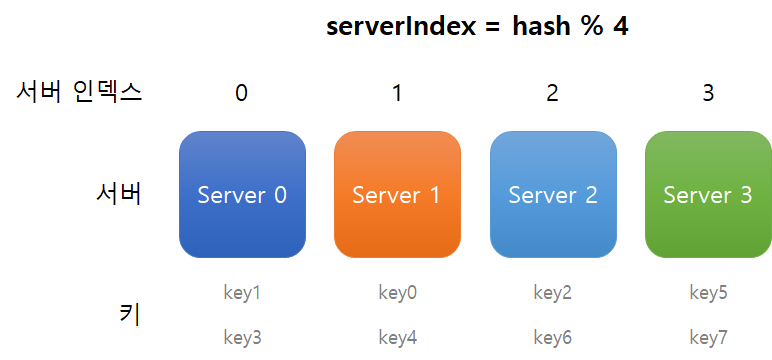

# 5장. 안정 해시 설계

# 해시 키 재배치(rehash) 문제

해시함수를 이용해 N캐의 캐시 서버에 부하를 균등하게 나누기

serverIndex = hash(key) % N(N은 서버 개수)

| 키 | 해시 | 해시 % 4(서버 인덱스) |
| --- | --- | --- |
| key0 | 18358617 | 1 |
| key1 | 26143584 | 0 |
| key2 | 18131146 | 2 |
| key3 | 35863496 | 0 |
| key4 | 34085809 | 1 |
| key5 | 27581703 | 3 |
| key6 | 38164978 | 2 |
| key7 | 22530351 | 3 |

특정한 키가 보관된 서버를 알아내기 위해, 나머지(modular) 연산을 f(key) % 4와 같이 적용했다.

hash(key0) % 4 = 1이면, 클라이언트는 캐시에 보관된 데이터를 가져오기 위해 서버 1에 접속해야 한다.

이 방법은 서버 풀(server pool)의 크기가 고정되어 있을 때, 그리고 데이터 분포가 균등할 때는 잘 동작한다.

→ 서버가 추가 또는 삭제되면 문제 발생

서버 1번이 죽으면 n은 3이 되고 서버 인덱스가 바뀌면서 1번 서버의 키 뿐만 아니라 모든 키가 재분배된다.

→ 대규모 캐시미스(cache miss) 발생

# 안정 해시

해시 테이블 크기가 조정될 때 평균적으로 오직 k/n개의 키만 재배치 (k: 키의 개수, n: 슬롯(slot)의 개수)

## 해시 공간과 해시 링

설명을 위한 사전 설정

- SHA-1 사용
- 함수 출력 값 범위는 x0, x1, x2, x3, ...xn
→ SHA-1 해시 공간(hash space) 범위는 0부터 2^160 -1

### 해시 공간

### 해시 링

캐시 링

## 해시 서버

해시 함수 f를 사용하면 서버 IP나 이름을 이 링 위의 어떤 위치에 대응시킬 수 있다.

## 해시 키

캐시할 키 또한 해시 링 위의 어느 지점에 배치할 수 있다.

## 서버 조회

키의 위치로부터 시계 방향으로 링을 만나는 첫 번째 서버가 해당 키의 서버다.

## 서버 추가

서버 s4가 추가된 상황이다.

s4가 k0과 s0 사이에 위치해 있기에 k0은 시계 방향으로 탐색할 경우 s4를 만나게 된다.

따라서, k0을 재배치 해줘야 한다.

## 서버 제거

하나의 서버가 제거되면 키 가운데 일부만 재배치된다.

s1이 제거되면 k1은 시계방향으로 탐색하면서 s2를 마주하게 된다.

따라서, k1은 s2로 재배치된다.

## 기본 구현법의 두 가지 문제

안정 해시 알고리즘 기본 절차

- 서버와 키를 균등분포 해시 함수를 사용해 해시 링에 배치
- 키의 위치에서 링을 시계 방향으로 탐색하다 만나는 최초의 서버에 키 저장

**문제점**

- 서버 추가/삭제로 인해 파티션의 크기를 균등하게 유지하는게 불가능함
- 서버 추가/삭제로 인해 키의 균등 분포가 어려움

> 파티션: 인접한 서버 사이의 해시 공간
> 

이 문제를 해결하기 위해 가상노트(virtual node) 또는 복제(replica) 방법 사용

## 가상 노드

실제 노드 또는 서버를 가리키는 노드로서, 하나의 서버는 링 위에 여러 개의 가상 노드를 가질 수 있다.

서버 0을 링에 배치하기 위해 s0_0, s0_1, s0_2 세 개 가상 노드를 사용하고, 서버 1을 링에 배치하기 위해 s1_0, s1_1, s1_2 세 개 가상노드를 사용했다.

각 서버는 하나가 아닌 여러 개 파티션을 관리해야 한다.

키의 위치로부터 시계방향으로 링을 탐색하다 만나는 최초의 가상 노드가 해당 키가 저장될 서버가 된다. k0은 s1_1, 즉, 서버1에 저장된다.

가상 노드의 개수를 늘리면 키의 분포는 점점 더 균등해진다. (100~200개 표준편차 값은 보통 5~10%)

## 재배치할 키 결정

서버가 추가/제거되면 키 일부는 재배치되어야 한다.

- 서버 추가 - 추가된 서버 반시계 방향의 노드 사이에 있는 모든 키들을 새로 추가된 서버로 재배치
- 서버 제거 - 삭제된 서버 반시계 방향의 노드 사이에 있는 모든 키들을 시계방향에 있는 서버에 저장

# 마치며

**안정 해시 이점**

- 서버 추가/삭제될 때 재배치되는 키의 수 최소화
- 데이터가 보다 균등하게 분포되므로 수평적 규모 확장에 좋음
- 핫스팟(hotspot) 키 문제 감소 - 과부하 방지