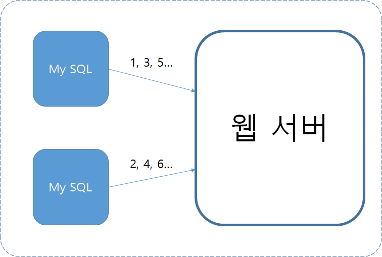

# 7장. 분산 시스템을 위한 유일 ID 생성기 설계

auto_increment 속성은 분산 환경에서는 통하지 않는다.

# 1단계 문제 이해 및 설계 범위 확정

설계 예시

- ID는 유일해야 하고, 정렬 가능해야 한다.
- ID의 값은 시간이 흐름에 따라 커질테지만 언제나 1씩 증가한다고 할 수는 없다.
- ID는 숫자로만 구성된다.
- ID는 64비트로 표현될 수 있는 값이어야 한다.
- 시스템 규모는 초당 10,000 ID를 생성할 수 있어야 한다.

# 개략적 설계안 제시 및 동의 구하기

ID 만드는 방법

- 다중 마스터 복제(multi-master replication)
- UUID(Universally Unique Identifier)
- 티켓 서버(ticket server)
- 트위터 스노플레이크(twitter snowflake)

## 다중 마스터 복제

다중 마스터 복제(multi-master replication)는 다음과 같은 구성을 갖는다.

이 접근법은 auto_increment 기능을 활용한다.

다만 ID의 값을 구할 때 1만큼 증가시키는 것이 아니라, k만큼 증가시킨다. 

이 k는 현재 사용 중인 데이터베이스 서버의 수다.

**단점**

- 여러 데이터 센터에 걸쳐 규모를 늘리기 어렵다.
- ID의 유일성은 보장되겠지만 그 값이 시간 흐름에 맞추어 커지도록 보장할 수는 없다.
- 서버를 추가하거나 삭제할 때도 잘 동작하도록 만들기 어렵다.

## UUID

컴퓨터 시스템에 저장되는 정보를 식별하기 위한 128비트짜리 수이며 충돌 가능성이 지극히 낮다.

UUID는 서버 간 조율 없이 독립적으로 생성 가능하다. 이 구조에서 각 웹 서버는 별도의 ID 생성기를 사용해 독립적으로 ID를 만들어낸다.

**장점**

- UUID를 만드는 것은 단순하다. 서버 사이의 조율이 필요 없으므로 동기화 이슈도 없다.
- 각 서버가 자기가 쓸 ID를 알아서 만드는 구조이므로 규모 확장도 쉽다.

**단점**

- ID가 128비트로 길다. 이번 장에서 다루는 문제의 요구사항은 64비트다.
- ID를 시간순으로 정렬할 수 없다.
- ID에 숫자(numeric) 아닌 값이 포함될 수 있다.

## 티켓 서버

auto_increment 기능을 갖춘 데이터베이스 서버, 특 티켓 서버를 중앙 집중형으로 하나만 사용한다.

**장점**

- 유일성이 보장되는 숫자로만 구성된 ID를 쉽게 만들 수 있다.
- 구현하기 쉽고, 중소 규모 애플리케이션에 적합하다.

**단점**

티켓 서버가 SPOF(Single-Point-of-Failure)가 된다. 이 서버에 장애가 발생하면, 해당 서버를 이용하는 모든 시스템이 영향을 받는다. 
서버를 여러 대 준비할 경우 데이터 동기화 같은 새로운 문제가 발생할 것이다.

## 트위터 스노플레이크 접근법

- 사인(sign) 비트: 1비트를 할당한다. 음수와 양수를 구별하는 데 사용 할 수 있다.
- 타임스탬프(timestamp): 41비트를 할당한다. 기원 시각(epoch) 이후로 몇 밀리초(millisecond)가 경과했는지를 나타내는 값이다.
- 데이터센터 ID: 5비트를 할당한다. 따라서 2^5 = 32개 데이터센터를 지원할 수 있다.
- 서버 ID: 5비트를 할당한다. 데이터센터당 32개 서버를 사용할 수 있다.
- 일련번호: 12비트를 할당한다. 각 서버에서는 ID를 생성할 때마다 이 일련번호를 1만큼 증가시킨다. 이 값은 1밀리초가 경과할 때마다 0으로 초기화(reset)된다.

# 추가 논의사항

- 시계 동기화(clock synchronization): ID 생성 서버들이 전부 같은 시계를 사용한다고 가정하였다. 하지만 이런 가정은 하나의 서버가 여러 코어에서 실행될 경우 유효하지 않을 수 있다. NTP(Network Time Protocol)은 이 문제를 해결하는 가장 보편적 수단이다.
- 각 섹션 길이 최적화: 동시성(concurrency)이 낮고 수명이긴 애플리케이션이라면 일련번호 절의 길이를 줄이고 타임스탬프 절의 길이를 늘리는 것이 효과적일 수도 있을 것이다.
- 고가용성(high availability): ID 생성기는 필수 불가결(mission critical) 컴포넌트이므로 아주 높은 가용성을 제공해야 할 것이다.