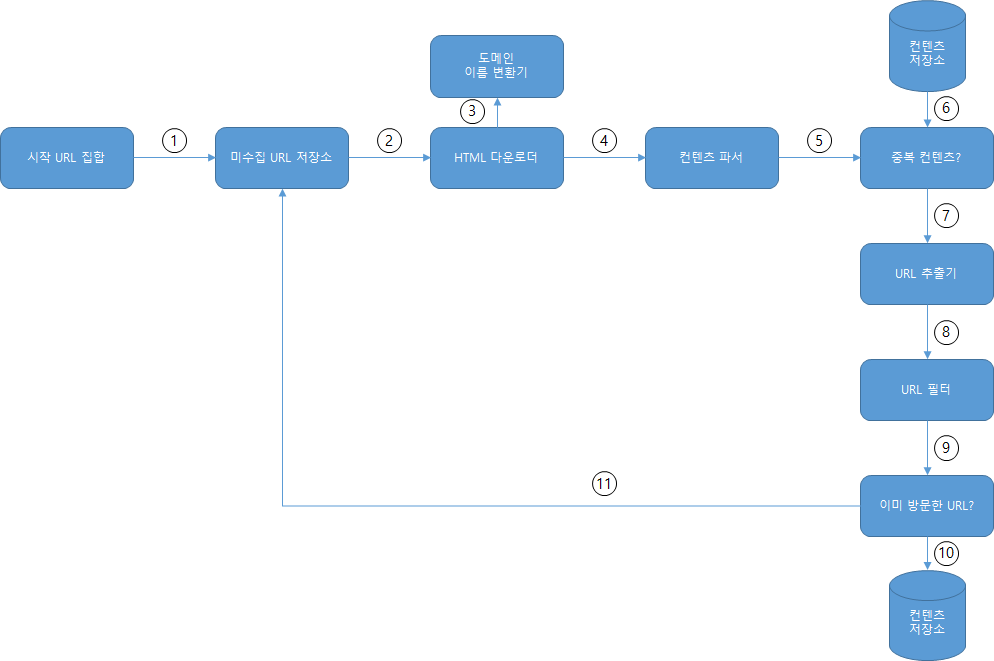

# 9장. 웹 크롤러 설계

웹 크롤러는 로봇(robot) 또는 스파이더(spider)라고도 부른다. 

**크롤러 이용 방식**

- 검색 엔진 인덱싱(search engine indexing): 웹 페이지를 모아 검색 엔진을 위한 로컬 인덱스(local index)를 만든다.
- 웹 아카이이빙(web archiving): 나중에 사용할 목적으로 장기보관하기 위해 웹에서 정보를 모으는 절차다.
- 웹 마이닝(web mining): 인터넷에서 유용한 지식을 도출한다.
- 웹 모니터링(web monitoring): 인터넷에서 저작권이나 상표권이 침해되는 사례 모니터링 할 수 있다.

# 1단계 문제 이해 및 설계 범위 확정

**알고리즘**

1. URL 집합이 입력으로 주어지면, 해당 URL들이 가리키는 모든 웹 페이지를 다운로드한다.
2. 다운받은 웹 페이지에서 URL들을 추출한다.
3. 추출된 URL들을 다운로드할 URL 목록에 추가하고 위의 과정을 처음부터 반복한다.

**고려속성**

- 규모 확장성: 웹은 거대하다. 병행성을 활용하면 보다 효과적으로 웹을 크롤링할 수 있다.
- 안정성(robustness): 잘못 작성된 HTML, 아무 반응이 없는 서버, 장애, 악성코드가 붙어 있는 링크 등이 있다. 이런 비정상적 입력이나 환경에 잘 대응할 수 있어야 한다.
- 예절(politeness): 짧은 시간 동안 너무 많은 요청을 보내서는 안된다.
- 확장성(extensibility): 새로운 형태의 콘텐츠를 지원하기 쉬워야 한다.

## 개략적 규모 추정

- 매달 10억 개의 웹 페이지를 다운로드한다.
- QAS = 10억/30일/24시간/3600초 = 대략 400페이지/초
- 최대(Peak) QPS = 2 X QPS = 800
- 웹 페이지의 크기 평균은 500k라고 가정
- 10억 페이지 X 500k = 500TB/월
- 1개월치 데이터를 보관하는 데는 500TB, 5년간 보관한다고 가정하면 500TB X 12개월 X 5년 = 30PB의 저장용량이 필요할 것이다.

# 2단계 개략적 설계안 제시 및 동의 구하기

### 시작 URL 집합

웹 크롤러가 크롤링을 시작하는 출발점

웹 페이지를 크롤링하는 가장 직관적인 방법은 해당 대학의 도메인 이름이 붙은 모든 페이지의 URL을 시작 URL로 사용하는 것

크롤러가 가능한 한 맡은 링크를 탐색할 수 있도록 하는 URL고르는 방법

전체 URL 공간을 작은 부분집합으로 나누는 전략 사용

- 지역적인 특색 사용 
ex) 나라별로 인기 있는 웹 사이트 다름
- 주제별로 다른 시작 URL 사용
ex) URL 공간을 쇼핑, 스포츠, 건강 등등의 주제별로 세분화하고 그 각각에 다른 시작 URL 사용

### 미수집 URL 저장소

현대적 웹 크롤링 상태를 (1) 다운로드할 URL, (2) 다운로드된 URL 두가지로 나눠 관리
다운로드할 URL을 ㅈ저앙 관리하는 컴포넌트를 미수집 URL 저장소(URL frontier)라고 한다

### HTML 다운로더

인터넷에서 웹 페이지를 다운로드하는 컴포넌트

### 도메인 이름 변환기

HTML 다운로더는 도메인 이름 변환기를 사용하여 URL에 대응되는 IP 주소를 알아낸다.

### 콘텐츠 파서

웹 페이지를 다운로드하면 파싱(parsing)과 검증(validation) 절차를 거쳐야 한다.

### 중복 컨텐츠 여부 확인

29%가량의 웹 피이즈 콘텐츠는 중복이다.

두 HTML 문서를 비교하는 가장 간단한 방법은 그 두 문서를 문자열로 보고 비교하는 것이지만 비효율적이다 → 해시 값을 비교하는 것이 효과적이다

### 콘텐츠 저장소

HTML 문서를 보관하는 시스템이다. 저장할 데이터의 유형, 크기, 저장소 접근 빈도, 데이터의 유효 기간 등을 종합적으로 고려해야 한다. 본 설계안의 경우에는 디스크와 메모리를 동시에 사용하는 저장소를  택한다.

- 데이터 양이 너무 많으므로 대부분의 콘텐츠는 디스크에 저장한다.
- 인기 있는 콘텐츠는 메모리에 두어 접근 지연시간을 줄일 것이다.

### URL 추출기

HTML 페이지를 파싱하여 링크들을 골라내는 역할을 한다.

상대 경로(는 전부 도메인을 붙여 절대 경로로 변환한다.

### URL 필터

다음 대상을 크롤링 대상에서 배제한다.

- 특정한 콘텐츠 타입이나 파일 확장자를 갖는 URL
- 접속 시 오류가 발생하는 URL
- 접근 제외 목록(deny list)에 포함된 URL 등

### 이미 방문한 URL 여부

이미 방문한 URL이나 미수집 URL 저장소에 보관된 URL을 추적할 수 있도록 하는 자료 구조를 사용할 것이다.  이미 방문한 적이 있는 URL인지 추적하면 서버 부하를 줄이고 무한 루프에 빠지는 일을 방지할 수 있다.

자료 구조로는 블룸 필터(bloom filter)나 해시 테이블이 널리 쓰인다.

### URL 저장소

이미 방문한 URL을 보관하는 저장소다.

## 웹 크롤러 작업 하름

1. 시작 URL들을 미수집 URL 저장소에 저장한다.
2. HTML 다운로더는 미수집 URL 저장소에서 URL 목록을 가져온다.
3. HTML 다운로더는 도메인 이름 변환기를 사용하여 URL의 IP주소를 알아내고, 해당 IP 주소로 접속하여 웹 페이지를 다운받는다.
4. 콘텐츠 파서는 다운된 HTML 페이지를 파싱하여 올바른 형식을 갖춘 페이지인지 검증한다.
5. 콘텐츠 파싱과 검증이 끝나면 중복 콘텐츠인지 확인하는 절차를 개시한다.
6. 중복 콘텐츠인지 확인하기 위해서, 해당 페이지가 이미 저장소에 있는지 확인한다.
- 이미 저장소에 있는 콘텐츠인 경우에는 처리하지 않고 버린다.
- 저장소에 없는 콘텐츠인 경우에는 저장소에 저장한 뒤 URL 추출기로 전달한다.
1. URL 추출기는 해당 HTML 페이지에서 링크를 골라낸다.
2. 골라낸 링크를 URL 필터로 전달한다.
3. 필터링이 끝나고 남은 URL만 중복 URL 판별 단계로 전달한다.
4. 이미 처리한 URL인지 확인하기 위하여, URL 저장소에 보관된 URL인지 살핀다. 이미 저장소에 있는 URL은 버린다.
5. 저장소에 없는 URL은 URL 저장소에 저장할 뿐 아니라 미수집 URL 저장소에도 전달한다.

# 3단계 상세 설계

- DFS vs BFS
- 미수집 URL 저장소
- HTML 다운로더
- 안정성 확보 전략
- 확장성 확보 전략
- 문제 있는 콘텐츠 감지 및 회피 전략

### DFS vs BFS

**BFS(breath-first search)**

BFS는 FIFO 큐를 사용하는 알고리즘이다. 여기에는 다음과 같은 문제가 있다.

- 한 페이지에서 나오는 링크의 상당수는 같은 서버로 되돌아간다. 
크롤러가 같은 호스트에 속한 많은 링크를 다운받느라 바빠질 경우 링크들을 병렬로 처리하게 되면 과부하에 걸리게 될 것이다. → impolite 크롤러가 될 수 있다.
- URL 간에 우선순위를 두지 않는다 → 페이지 랭크, 사용자 트래픽의 양, 업데이트 빈도 등 여러 가지 척도에 비추어 우선순위를 구별하는 것이 좋다.

### 미수집 URL 저장소

**Polite**

웹 크롤러는 수집 대상 서버로 짧은 시간 안에 너무 많은 요청을 보내는 것을 삼가야 한다.

이를 위해 동일 웹 사이트에 대해서는 한 번에 한 페이지만 요청해야 한다.

같은 웹 사이트의 페이지를 다운받는 태스크는 시간차를 두고 실행하도록 한다.

이 요구사항을 만족시키려면 호스트명(hostname)과 다운로드를 수행하는 작업 스레드(worker thread) 사이의 관계를 유지하면 된다.

각 다운로드 스레드는 별도 FIFO 큐를 가지고 있어서, 해당 큐에서 꺼낸 URL만 다운로드한다.

- 큐 라우터(queue router): 같은 호스트에 속한 URL은 언제나 같은 큐(b1, b2, ... , bn)로 가도록 보장하는 역할을 한다.
- 매핑 테이블(mapping table): 호스트 이름과 큐 사이의 관계를 보관하하는 테이블.
- FIFO 큐(b1부터 bn까지): 같은 호스트에 속한 URL은 언제나 같은 큐에 보관한다.

| 호스트 | 큐 |
| --- | --- |
| wikipedia.com | b1 |
| apple.com | b2 |
| ... | ... |
| nike.com | bn |
- 큐 선택기(queue selector): 큐들을 순회하면서 큐에서 URL을 꺼내서 해당 큐에서 나온 URL을 다운로드하도록 지정된 작업 스레드에 전달하는 역할을 한다.
- 작업 스레드(worker thread): 전달된 URL을 다운로드하는 작업을 수행한다. 전달된 URL은 순차적으로 처리할 것이며, 작업들 사이에는 일정한 지연시간(delay)을 둘 수 있다.

### 우선순위

애플 제품 사용에 대한 의견이 올라오는 포럼의 한 페이지 vs 애플 홈페이지 → 둘다 키워드가 애플이지만 애플 홈페이지의 중요도가 높다. 크롤러 입장에서는 애플 홈페이지를 먼저 수집하도록 하는  것이 바람직하다.

유용성에 따라 URL의 우선순위를 나눌 때는 페이지랭크(PageRank), 트래픽 양, 갱신 빈도(update frequency) 등 다양한 척도를 사용 사능하다.

- 순위결정장치(prioritizer): URL을 입력으로 받아 우선순위를 계산한다.
- 큐(f1, ... fn): 우선순위별로 큐가 하나씩 할당된다. 우선순위가 높으면 선택될 확률도 올라간다.
- 큐 선택기: 임의 큐에서 처리할 URL을 꺼내는 역할을 담당한다. 수누이가 높은 큐에서 더 자주 꺼내도록 프로그램되어 있다.

두 개 모듈 결합

- 전면 큐(front queue): 우선순위 결정 과정을 처리한다.
- 후면 큐(back queue): 크롤러가 polite하게 동작하도록 보증한다.

### 신선도(freshness)

웹 페이지는 수시로 추가/삭제/변경된다.

데이터의 신선도를 유지하기 위해 주기적으로 재수집할 필요가 있다.

이를 위해 다음과 같은 전략을 사용한다.

- 웹 페이지의 변경 이력(update history) 활용
- 우선순위를 활용하여, 중요한 페이지는 좀 더 자주 재수집

### 미수집 URL 저장소를 위한 지속성 저장장치

URL을 전부 메모리에 보관하는 것은 안정성이나 규모 확장성 측면에서 바람직하지 않다. 디스크에 저장할 경우에는 성능 병목지접이 되기 쉽다.

→ URL은 디스크에 두지만 메모리 버퍼에 큐를 두는 방법을 사용한다.

## HTML 다운로더

HTML 다운로더(downloader)는 HTTP 프로토콜을 통해 웹 페이지를 내려 받는다. 먼저 로봇 제외 프로토콜부터 살펴보고 넘어가자.

### Robots.txt

로봇 제외 프로토콜이라고 부르기도 하며, 웹사이트가 크롤러와 소통하는 표준적 방법이다.

이 파일에는 크롤러가 수집해도 되는 페이지 목록이 들어있다.

Robots.txt 파일을 연거푸 다운로드하는 것을 피하기 위해, 이 파일은 주기적으로 다시 다운받아 캐시에 보관할 것이다.

### **성능 최적화**

**분산 크롤링**

크롤링 작업을 여러 서버에 분산하는 방법이다. 각 서버는 여러 스레드를 돌려 다운로드 작업을 처리한다.

이 구성을 위해 URL 공간은 작은 단위로 분할하여, 각 서버는 그중 일부의 다운로드를 담당하도록 한다.

**도메인 이름 변환 결과 캐시**

도메인 이름 변환기(DNS Resolver)는 크롤러 성능의 병목 중 하나인데, 이는 DNS 요청을 보내고 결과를 받는 작업의 동기적 특성 때문이다. DNS 요청의 결과를 받기 전까지는 다음 작업을 진행할 수 없는 것이다.

크롤러 스레드 가운데 어느 하나라도 이 작업을 하고 있으면 다른 스레드의 DNS 요청은 전부 블록(block)된다.

따라서 DNS 조회 결과로 얻어진 도메인 이름과 IP 주소 사이의 관계를 캐시에 보관해 놓고 크론 잡(cron job) 등을 돌려 주기적으로 갱신하도록 해 놓으면 성능을 효과적으로 높일 수 있다.

**지역성(locality)**

서버를 지역별로 분산하는 방법이다. 크롤링 서버가 크롤링 대상 서버와 지역적으로 가까우면 페이지 다운로드 시간은 줄어들 것이다.

**짧은 타임아웃**

어떤 웹 서버는 응답이 느리거나 아예 응답하지 않는다. 이런 경우 최대 얼마나 기다릴지를 미리 정해 놓고 시간이 지나면 해당 페이지 다운로드를 중단하고 다음 페이지로 넘어간다.

### 안정성

- 안정 해시(consistent hashing): 다운로더 서버들에 부하를 분산할 때 적용 가능한 기술이다. 이 기술로 다운로더 서버를 쉽게 추가하고 삭제할 수 있다.
- 크롤링 상태 및 수집 데이터 저장: 장애가 발생한 경우에도 쉽게 복구할 수 있도록 크롤링 상태와 수집된 데이터를 지속적 저장장치에 기록해 두는 것이 바람직하다.
- 예외 처리(exception handling): 예외가  발생해도 전체 시스템이 중단되는 일이 없도록 한다.
- 데이터 검증(data validation): 시스템 오류를 방지하기 위한 중요 수단 가운데 하나다.

### 확장성

시스템은 진화하기에 새로운 형태의 콘텐츠를 쉽게 지원할 수 있도록 신경 써야 한다.

### 문제 있는 콘텐츠 감지 및 회피

**중복 콘텐츠**

웹 콘텐츠의 30% 가량은 중복이다. 따라서 해시나 체크섬(check-sum)을 사용하면 중복 콘텐츠를 보다 쉽게 탐지 가능하다.

**거미 덫(Spider trap)**

거미 덫은 크롤러를 무한 루프에 빠뜨리도록 설계한 웹 페이지다.

이를 피하기 위해서는 수작업으로 크롤러 탐색 대상에서 제외하거나 URL 필터 목록에 걸어두는 작업이 필요하다.

**데이터 노이즈**

광고나 스크립트 코드, 스팸 URL 등은 거의 가치가 없다.

# 마무리

이번 장에서 크롤러가 갖추어야 할 특징으로 규모 확장성(scalability), polite, 확장성(extensibility), 안정성 등을 확인해보았다.

### 추가 논의사항

- 서버 측 렌더링(server-side rendering): 동적으로 링크가 생성되는 이슈를 방지한다.
- 원치 않는 페이지 필터링: 스팸 방지(anti-spam) 컴포넌트를 두어 품질이 조악하거나 스팸성인 페이지를 걸러내도록 해두면 좋다.
- 데이터베이스 다중화 및 샤딩: 다중화(replication)이나 샤딩(sharding)같은 기법을 적용하면 데이터 계층(data layer)의 가용성, 규모 확장성, 안정성이 향상된다.
- 수평적 규모 확장성(horizontal scalability): 규모 화갖ㅇ성을 달성하는 데 중요한 것은 서버가 stateless 상태를 유지하는 것이다.